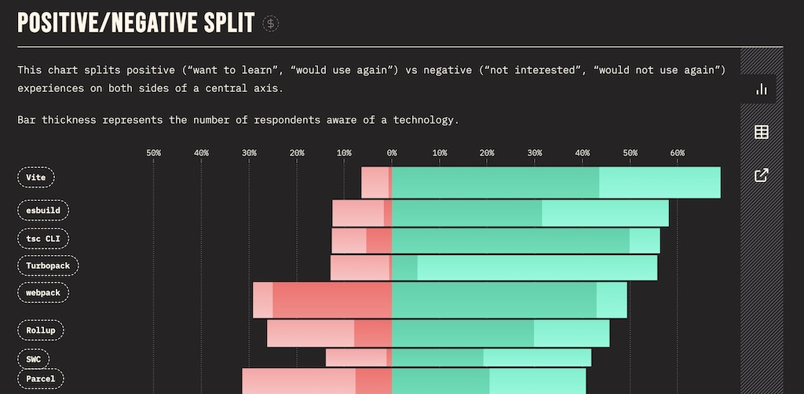
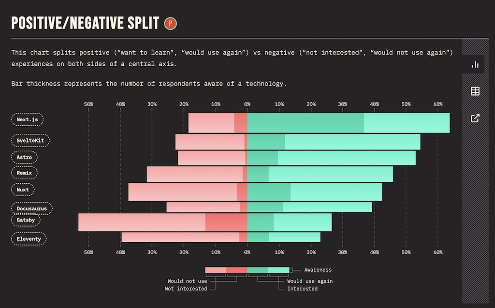
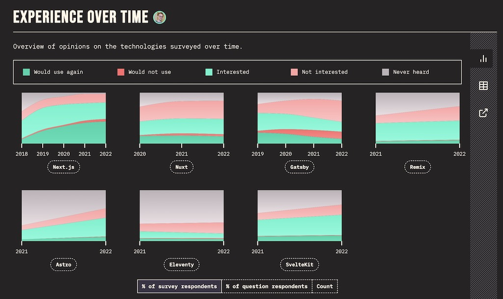
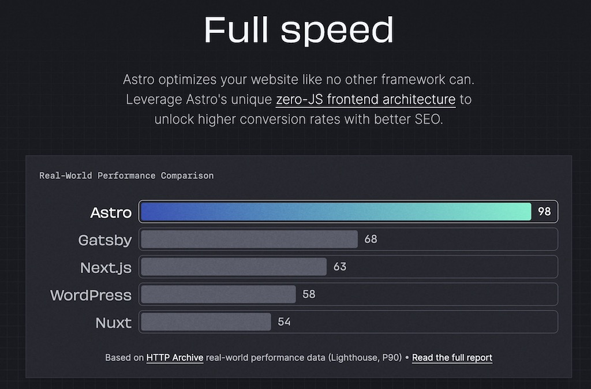

<Sponsorship />

Every year I want to give you a brief overview of how to start a new React project. I want to reflect on advantages and disadvantages, on the skill-level needed as a developer, and on what features each starter project has to offer for you as a React developer. At the end you will know about 3 solutions for different requirements.

*Note: The screenshots are taken from last years [State of JavaScript](https://stateofjs.com/), because the newest results are not online yet.*

# React with Vite

[Vite](https://vitejs.dev/) is the clear successor of the most popular (now deprecated) React starter called create-react-app (CRA), because it does not much deviate from it. Compared to CRA (which used Webpack) it is much faster, because it uses [esbuild](https://esbuild.github.io/) under the hood.

Vite favors creating a single-page application (SPA) with client-side routing/rendering over server-side rendering (SSR). However, since SSR is becoming a more important topic these days, it is available as opt-in feature in Vite.

When coming from a create-react-app (CRA), it is a straightforward [migration to Vite](/vite-create-react-app/). Opt-in features like [TypeScript](/vite-typescript/), SVG, and SSR are only a few configurations away with Vite's *vite.config.js* file, in addition to feature specific files (e.g. *tsconfig*).

Vite with React allows developers to use React without an opinionated framework. It's up to the developer to choose complementary React libraries for routing, data fetching, state management and [testing](/vitest-react-testing-library/). Compared to all the React frameworks, it doesn't force any specific React features, libraries, or configurations (on a project level) on you.

<ReadMore label="React Libraries for 2024" link="/react-libraries/" />

Last but not least, Vite encourages beginners to learn React and its fundamentals without the distraction of a framework. When I updated my book [The Road to React](https://www.amazon.com/dp/B077HJFCQX) in 2022, I replaced create-react-app with Vite. While Vite takes the passenger seat, a beginner can solely focus on React and its core features.

In contrast, when learning React in the environment of a framework, React almost takes the passenger seat and one has to follow the opinions (e.g. file-based routing) of the framework instead.

**React with Vite Advantages:**

* almost drop-in replacement for create-react-app (CRA)
* still SPA/CSR friendly, but SSR is opt-in
* no framework/company lock-in
* lightweight
* does not mingle with React on a feature level
  * therefore focus on React itself and not a framework
* gentle learning curve for getting to know React's fundamentals
* Vite is used in many frameworks beyond React

**React with Vite Disadvantages:**

* prioritizes SPA/CSR
* no framework support
* limited access to architectural features provided by React for integrated frameworks
  * e.g. React Server Components (RSC)

# React with Next

[Next.js](https://nextjs.org/) as a framework is the most mature and therefore obvious choice when a React developer wants to use React in an opinionated framework environment. It comes with many batteries included. If Next.js is not your cup of tea though, check out [Remix](https://remix.run/).

Next.js prioritizes server-side rendering (SSR) as rendering technique. However, it can be used with static-site generation (SSG), incremental static regeneration (ISR), and client-side rendering (CSR, see React with Vite) too. On top there are a several more bleeding edge rendering techniques like React Server Components (RSC) available.

What makes this more mind blowing: You can mix and match rendering techniques in a Next.js application. While a marketing page can use SSG, the actual application behind the sign in/up uses SSR.

<ReadMore label="Guide to Web Applications (SSG, SSR, CSR, SPAs)" link="/web-applications/" />

There comes a cost with this much power though: Different rendering techniques create an engineering overhead, the framework works on new rendering techniques constantly and not all day to day tech workers are able to keep up with the pace.

In conclusion, while Next.js comes with many batteries included (e.g. file-based routing), it also comes with responsibilities. While React itself (e.g. with Vite) stays relatively stable, you will definitely see changes in the Next.js ecosystem, because they are working on the forefront bringing React to the server.

**Next.js Advantages:**

* opinionated framework with built-in libraries
* SSR and many other rendering techniques
  * performance boost (caveat: if done right)
  * improved SEO compared to CSR (see React with Vite)
* Vercel as big player with lots of funding
  * works closely with the React core team
  * has several React core team members hired in the past
* working on the bleeding edge

**Next.js Disadvantages:**

* working on the bleeding edge
* overhead/stability/maintainability compared to only React with Vite
* steeper learning curve compared to React with Vite
  * more focus on framework specifics, less on React itself
* fewer options [self-hosting](https://nextjs.org/docs/app/building-your-application/deploying#self-hosting) (Node.js, Docker, static files)

# React with Astro

[Astro](https://astro.build/) allows developers to create content-focused websites. Because of its island architecture and therefore selective hydration, it gives every website fast performance by default. Therefore SEO relevant websites profit from using Astro.

From an implementation perspective, it favors the concept of multi-page applications (MPAs) over single-page applications (SPAs). Therefore it [closes the historical cycle](/web-applications/): from MPAs being the predominantly kind of a website (prior 2010) to SPAs taking over (2010 - 2020) to going back to MPAs (and thus making MPAs a term in the first place).

Astro is a framework (here: React) agnostic solution. Thus you can use Astro's built-in component syntax or a framework (e.g. React) of your choice. The framework is only there for server-side rendering though and is not exposed to the client. Only if one decides to hydrate an interactive island (see island architecture) to the client, it gets all the necessary JavaScript code shipped to the browser.

In conclusion, even though Next (with either SSR/SSG/ISR) would be a fit for content-focused websites too, Astro seems to fit the more specific requirements (performance, SEO, content as first-class citizen (e.g. collections, MDX)) of having a content-focused website here.

**React with Astro Advantages:**

* content-focused websites
* performance
* SEO
* framework (e.g. React) agnostic

**React with Astro Disadvantages:**

* not advertised for dynamic web applications
  * but they are heavily exploring this space

## More options to start a React project ...

* [Parcel](https://parceljs.org/) instead of Vite
* [Monorepo Setup](/javascript-monorepos/) (e.g. Turborepo) with opt-in Vite, Next, and/or Astro
* [create-t3-app](https://create.t3.gg/) for [tRPC](/react-trpc/)
* [React Native](https://reactnative.dev/) + [Expo](https://expo.dev/) for mobile applications
* [Tauri](https://tauri.app/)/[Electron](https://www.electronjs.org/) for desktop applications

## TypeScript/JavaScript SSR frameworks which do not use React ...

* Nuxt (Vue)
* SvelteKit (Svelte)
* SolidStart (Solid)
* QwikCity (Qwik)

# How to start a React Project?

* If you are starting out to learn React (from an educators perspective), stick to **Vite with React**, because it stays as close as possible to React's fundamentals. The same holds true if you are only looking for a lightweight SPA/CSR solution.
* If you are looking for an opinionated framework on top of React with several rendering techniques (and infrastructure) included, I'd recommend using **Next with React** as the most mature solution with all its advantages and disadvantages.
  * If Next.js does not fit your needs but you are still looking for an all batteries included SSR framework, check out **Remix with React**.
* If you want to have a content-focused website, check out **Astro with React**.

<ReadMore label="How to learn React in 2024" link="/learning-react/" />
